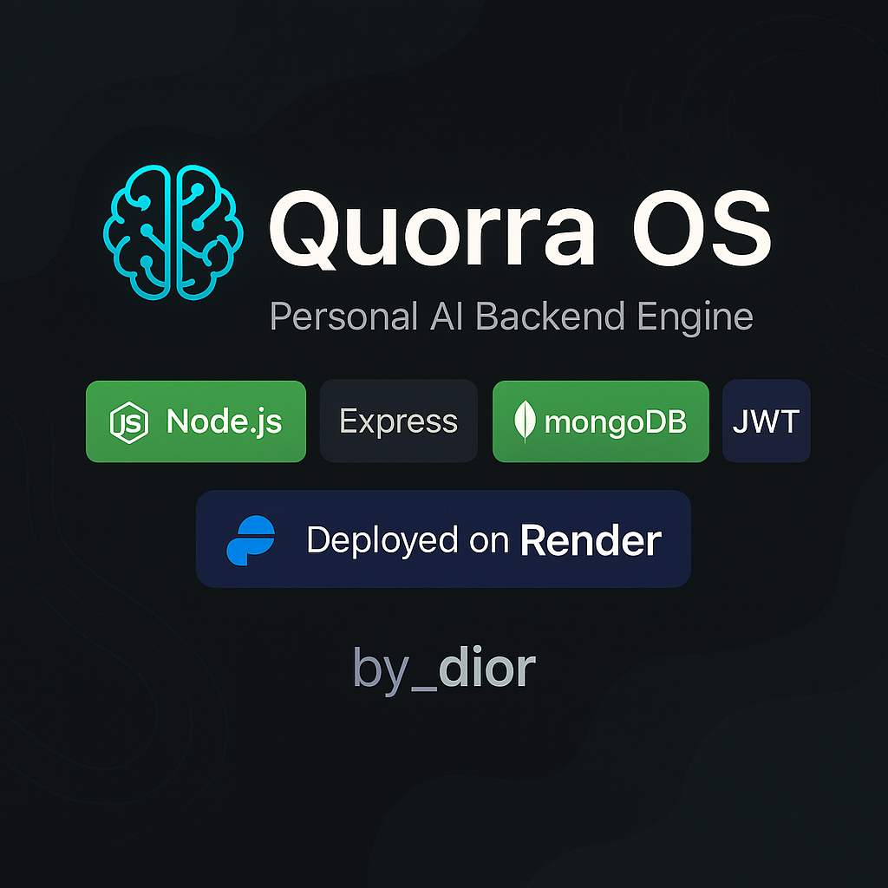

# 🧠 Quorra OS — Personal AI Backend Engine

[](#)
[](#)
[](#)
[](https://quorra-os-api.onrender.com)

> ⚡️ Yaratilgan: `by_dior` | Til: Node.js  
> 🧬 Backend sun’iy ong yadrosi — xotira, media, va tizim komanda interfeysi

---

## 🚀 Texnologiyalar

| Texnologiya | Tavsif |
|------------|--------|
| 🟢 Node.js + Express | REST API, modular server |
| 🟢 MongoDB (Mongoose) | JSON-based xotira, media snapshot’lari |
| 🔒 JWT Autentifikatsiya | Login va token orqali himoya |
| 📼 Media Engine | Audio/video fayllarni boshqaradi |
| 🧠 Memory Model | Foydalanuvchi konteksti va AI xotirasi |
| 🔁 Offline Sync | Internet yo‘q vaqtda JSON queue |

---

## 📂 Loyihaning tuzilishi

```
quorra-os/
├── backend/
│   ├── controllers/    # API mantiqlari
│   ├── models/         # MongoDB sxemalari
│   ├── routes/         # REST endpoint’lar
│   ├── services/       # Media va sinxronizatsiya
│   ├── middlewares/    # Auth, rootGuard, watchdog
│   ├── utils/          # Generator va yordamchilar
│   └── index.js        # Express ilovasi
├── .env.example
├── README.md
├── package.json
```

---

## ⚙️ Ishga tushirish

### 📦 1. Bog‘lamalarni o‘rnatish

```bash
cd backend
npm install
```

### 🚀 2. Serverni ishga tushurish

```bash
npm run dev
```

> 🔗 Lokal API: `http://localhost:5000`

---

## 🔐 `.env` konfiguratsiyasi

`.env.example` fayli namunasi:

```env
MONGO_URI=mongodb://localhost:27017/quorra-os
JWT_SECRET=quorraSuperSecret
PORT=5000
ROOT_PIN=0000
SYNC_INTERVAL_MINUTES=15
```

---

## 📡 API Marshrutlar

| URL | Method | Tavsif |
|-----|--------|--------|
| `/auth/register` | POST | Ro‘yxatdan o‘tish |
| `/auth/login` | POST | Token olish |
| `/memory/save` | POST | Xotirani saqlash |
| `/media/upload` | POST | Media joylashtirish |
| `/command/save` | POST | Komanda arxivi |
| `/notifications/create` | POST | Bildirishnoma qo‘shish |
| `/system/volume` | POST | Tizim ovozi (root) |

> ⚠️ Ko‘pchilik endpointlar uchun `Authorization: Bearer <JWT>` talab qilinadi.

---

## 🔁 Offline Sync (📶 yo‘q bo‘lganda)

- Foydalanuvchining komandasi `storage/pendingQueue.json` faylga saqlanadi
- `syncService.js` orqali `SYNC_INTERVAL_MINUTES` asosida serverga yuboriladi
- Bu yordamda `Quorra` internetga qaytganda ham “eslab turadi”

---

## 🌐 Deployment: Render.com

1. Web Service → GitHub’dan `quorra-os`
2. Root dir: `backend/`
3. Build command: `npm install`
4. Start command: `npm run dev`
5. Add Environment Variables: `.env` qiymatlari

🟢 Live Link: [https://quorra-os-api.onrender.com](https://quorra-os-api.onrender.com)

---

## 📸 Preview (optional)

```markdown

```

---

## 👨‍💻 Muallif

**by_dior**  
📁 GitHub: [@dior4003](https://github.com/dior4003)  
📡 Telegram: [@by_dior](https://t.me/diorbekyoldashov)  
🎨 Uslub: Texnik xolistiklik + kreatif estetika

---

## ⚖️ Litsenziya

MIT License — loyiha ochiq, sizning g‘oyalaringizga ochiq. Fikr va takliflar olqishlanadi.

